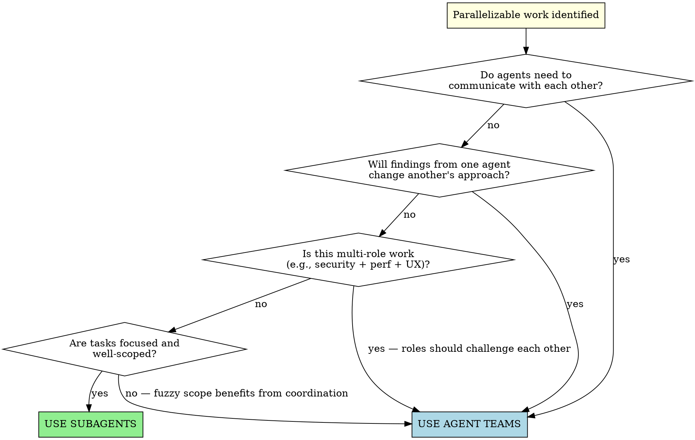

# Choosing an Agent Strategy

When you have work that can be parallelized, you need to pick the right tool: **subagents** (focused workers that report back) or **agent teams** (coordinated teammates that communicate with each other).

The wrong choice wastes tokens or misses opportunities. Subagents are cheaper but can't share findings. Agent teams enable collaboration but cost more and add coordination overhead.

## Decision Flowchart



## Quick Reference

| Signal | Use Subagents | Use Agent Teams |
|--------|---------------|-----------------|
| **Communication** | Only the result matters | Agents need to share findings, debate, or challenge each other |
| **Task coupling** | Independent — no shared state | Cross-cutting — one agent's findings inform another's work |
| **Scope clarity** | Well-defined, focused tasks | Fuzzy scope that benefits from collaborative exploration |
| **Example** | "Fix these 3 test files" | "Investigate this bug from 5 angles and debate root cause" |
| **Example** | "Summarize each of these docs" | "Review this PR for security, perf, and test coverage" |
| **Example** | "Run this task with/without skill" | "Build this feature across frontend, backend, and tests" |
| **Token cost** | Lower — results summarized back | Higher — each teammate is a separate Claude instance |
| **Coordination** | You manage all work | Teammates self-coordinate via shared task list |

## Subagent Sweet Spots

Subagents shine when work is **independent and well-scoped**:

- Fixing different test files with unrelated failures
- Running the same task with different configurations (A/B testing)
- Searching/summarizing independent parts of a codebase
- Grading or reviewing outputs against clear criteria
- Any task where you just need the answer back

The pattern: dispatch, wait, collect results, integrate. See `lril-superpowers:dispatching-parallel-agents` for the full execution guide.

## Agent Team Sweet Spots

Agent teams shine when work is **collaborative and cross-cutting**:

- **Research with competing hypotheses** — teammates investigate different theories and actively try to disprove each other. A single agent anchors on its first theory; a team debates until the strongest theory survives.
- **Multi-role review** — security reviewer, performance reviewer, and test coverage reviewer each apply a different lens to the same PR. They can flag when their concerns interact (e.g., "the security fix the other reviewer suggested would hurt performance here").
- **Cross-layer feature building** — frontend, backend, and test teammates each own their layer but coordinate on interfaces. They message each other about contract changes instead of discovering mismatches at integration time.
- **Debugging across subsystems** — when a bug might live in the API layer, the data layer, or the client, teammates investigate in parallel and share findings that narrow the search space for everyone.

## Enabling Agent Teams

Agent teams are experimental and disabled by default. If you recommend agent teams for a task, check whether they're enabled and provide the enable step if needed.

To enable, add to settings.json:
```json
{
  "env": {
    "CLAUDE_CODE_EXPERIMENTAL_AGENT_TEAMS": "1"
  }
}
```

Or set the environment variable directly:
```bash
export CLAUDE_CODE_EXPERIMENTAL_AGENT_TEAMS=1
```

If agent teams aren't available (not enabled, or running on a platform that doesn't support them), fall back to subagents — they're always available and still parallelize effectively.

## Same Scenario, Two Approaches

**Scenario:** 3 failing test suites after a refactor — auth tests, API tests, and UI tests.

### Subagent approach (use this one)
The failures are in independent subsystems. Each agent fixes its own test file and reports back. No cross-talk needed.

```
Subagent 1 → Fix auth.test.ts → "Fixed: token refresh timing"
Subagent 2 → Fix api.test.ts → "Fixed: missing header in mock"
Subagent 3 → Fix ui.test.ts → "Fixed: selector changed after refactor"
```

Collect results, verify no conflicts, run full suite.

### Agent team approach (overkill here)
You'd pay for 3 separate Claude instances plus coordination overhead, but the agents don't need to talk to each other. The extra cost buys nothing.

---

**Scenario:** Users report the app crashes after one message. Root cause unclear.

### Subagent approach (insufficient)
Each agent investigates one hypothesis in isolation. Agent 1 finds a connection timeout. Agent 2 finds a race condition. Neither knows the other's finding, so you have to manually figure out if these are related.

### Agent team approach (use this one)
Teammates investigate different hypotheses and actively challenge each other:

```
Create an agent team to investigate the crash:
- Teammate 1: investigate connection/networking issues
- Teammate 2: investigate state management and race conditions
- Teammate 3: investigate error handling and recovery paths
Have them share findings and challenge each other's theories.
```

Teammate 1 discovers a timeout. Teammate 2 finds the timeout triggers a race condition in the reconnect handler. Together they converge on the real root cause faster than either would alone.

## After Choosing

- **Chose subagents?** → Use `lril-superpowers:dispatching-parallel-agents` for the execution pattern
- **Chose agent teams?** → Use the Agent Team Pattern section in `lril-superpowers:dispatching-parallel-agents` for team orchestration guidance
