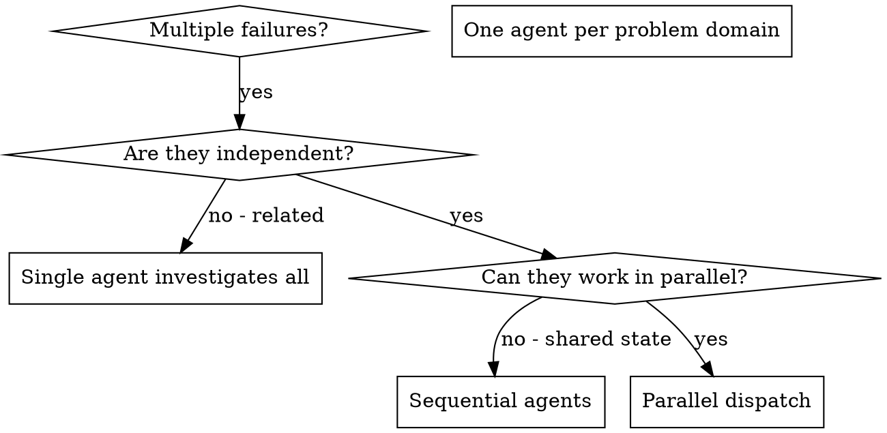
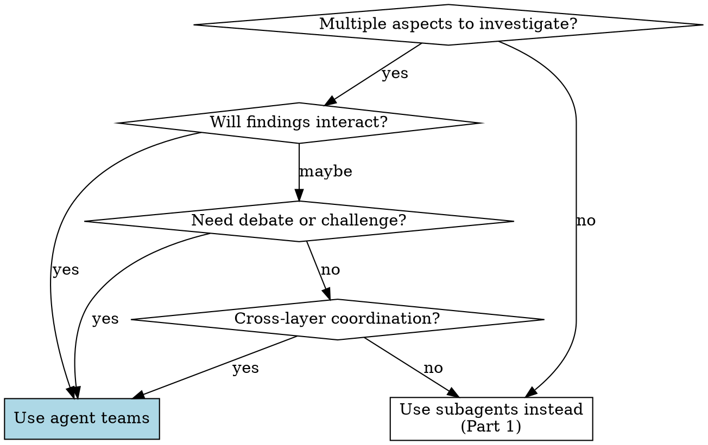

# Dispatching Parallel Agents

## Overview

When you have multiple tasks that can happen in parallel, you have two tools: **subagents** (focused workers that report back) and **agent teams** (coordinated teammates that communicate with each other).

**Core principle:** Match the tool to the task. Independent work → subagents. Collaborative work → agent teams.

If you haven't decided which approach to use, start with `lril-superpowers:choosing-agent-strategy`.

---

# Part 1: Subagent Dispatch

For focused, independent tasks where only the result matters.

**Core principle:** Dispatch one agent per independent problem domain. Let them work concurrently.

## When to Use



**Use when:**
- 3+ test files failing with different root causes
- Multiple subsystems broken independently
- Each problem can be understood without context from others
- No shared state between investigations

**Don't use when:**
- Failures are related (fix one might fix others)
- Need to understand full system state
- Agents would interfere with each other

## The Pattern

### 1. Identify Independent Domains

Group failures by what's broken:
- File A tests: Tool approval flow
- File B tests: Batch completion behavior
- File C tests: Abort functionality

Each domain is independent - fixing tool approval doesn't affect abort tests.

### 2. Create Focused Agent Tasks

Each agent gets:
- **Specific scope:** One test file or subsystem
- **Clear goal:** Make these tests pass
- **Constraints:** Don't change other code
- **Expected output:** Summary of what you found and fixed

### 3. Dispatch in Parallel

```typescript
// In Claude Code / AI environment
Task("Fix agent-tool-abort.test.ts failures")
Task("Fix batch-completion-behavior.test.ts failures")
Task("Fix tool-approval-race-conditions.test.ts failures")
// All three run concurrently
```

### 4. Review and Integrate

When agents return:
- Read each summary
- Verify fixes don't conflict
- Run full test suite
- Integrate all changes

## Agent Prompt Structure

Good agent prompts are:
1. **Focused** - One clear problem domain
2. **Self-contained** - All context needed to understand the problem
3. **Specific about output** - What should the agent return?

```markdown
Fix the 3 failing tests in src/agents/agent-tool-abort.test.ts:

1. "should abort tool with partial output capture" - expects 'interrupted at' in message
2. "should handle mixed completed and aborted tools" - fast tool aborted instead of completed
3. "should properly track pendingToolCount" - expects 3 results but gets 0

These are timing/race condition issues. Your task:

1. Read the test file and understand what each test verifies
2. Identify root cause - timing issues or actual bugs?
3. Fix by:
   - Replacing arbitrary timeouts with event-based waiting
   - Fixing bugs in abort implementation if found
   - Adjusting test expectations if testing changed behavior

Do NOT just increase timeouts - find the real issue.

Return: Summary of what you found and what you fixed.
```

## Common Mistakes

**❌ Too broad:** "Fix all the tests" - agent gets lost
**✅ Specific:** "Fix agent-tool-abort.test.ts" - focused scope

**❌ No context:** "Fix the race condition" - agent doesn't know where
**✅ Context:** Paste the error messages and test names

**❌ No constraints:** Agent might refactor everything
**✅ Constraints:** "Do NOT change production code" or "Fix tests only"

**❌ Vague output:** "Fix it" - you don't know what changed
**✅ Specific:** "Return summary of root cause and changes"

## When NOT to Use

**Related failures:** Fixing one might fix others - investigate together first
**Need full context:** Understanding requires seeing entire system
**Exploratory debugging:** You don't know what's broken yet
**Shared state:** Agents would interfere (editing same files, using same resources)

## Real Example from Session

**Scenario:** 6 test failures across 3 files after major refactoring

**Failures:**
- agent-tool-abort.test.ts: 3 failures (timing issues)
- batch-completion-behavior.test.ts: 2 failures (tools not executing)
- tool-approval-race-conditions.test.ts: 1 failure (execution count = 0)

**Decision:** Independent domains - abort logic separate from batch completion separate from race conditions

**Dispatch:**
```
Agent 1 → Fix agent-tool-abort.test.ts
Agent 2 → Fix batch-completion-behavior.test.ts
Agent 3 → Fix tool-approval-race-conditions.test.ts
```

**Results:**
- Agent 1: Replaced timeouts with event-based waiting
- Agent 2: Fixed event structure bug (threadId in wrong place)
- Agent 3: Added wait for async tool execution to complete

**Integration:** All fixes independent, no conflicts, full suite green

**Time saved:** 3 problems solved in parallel vs sequentially

## Key Benefits

1. **Parallelization** - Multiple investigations happen simultaneously
2. **Focus** - Each agent has narrow scope, less context to track
3. **Independence** - Agents don't interfere with each other
4. **Speed** - 3 problems solved in time of 1

## Verification

After agents return:
1. **Review each summary** - Understand what changed
2. **Check for conflicts** - Did agents edit same code?
3. **Run full suite** - Verify all fixes work together
4. **Spot check** - Agents can make systematic errors

## Real-World Impact

From debugging session (2025-10-03):
- 6 failures across 3 files
- 3 agents dispatched in parallel
- All investigations completed concurrently
- All fixes integrated successfully
- Zero conflicts between agent changes

---

# Part 2: Agent Team Orchestration

For complex work where agents need to communicate, share findings, and challenge each other. Agent teams are separate Claude Code instances with shared task lists and inter-agent messaging.

**Core principle:** Use agent teams when the collaboration between agents is as valuable as their individual work.

## When to Use Agent Teams



**Use when:**
- Investigating a bug with multiple competing hypotheses that should be debated
- Multi-role review (security + performance + testing) where concerns may interact
- Building features across frontend, backend, and tests that share interfaces
- Research where different angles should converge into a synthesis
- Any work where one agent's findings should change another agent's approach

**Don't use when:**
- Tasks are independent and well-scoped (use subagents)
- You just need results collected — no cross-talk needed
- Token cost is a concern — agent teams use significantly more tokens
- The task is sequential or has tight dependencies between steps

## Enabling Agent Teams

Agent teams are experimental and disabled by default. Before using them, ensure they're enabled:

```json
// In settings.json
{
  "env": {
    "CLAUDE_CODE_EXPERIMENTAL_AGENT_TEAMS": "1"
  }
}
```

If agent teams aren't available, fall back to subagents. They still parallelize effectively — you just lose inter-agent communication.

## The Agent Team Pattern

### 1. Define Roles and Purpose

Each teammate needs a distinct role that justifies being a separate agent. Roles should be complementary, not overlapping.

Good role splits:
- **By perspective:** security reviewer, performance reviewer, UX reviewer
- **By hypothesis:** "it's a connection issue", "it's a race condition", "it's an error handling gap"
- **By layer:** frontend, backend, data/infrastructure
- **By domain:** auth module, billing module, notification module

Bad role splits:
- Overlapping scopes (two agents both reviewing "code quality")
- Roles that can't produce independent value
- More roles than the task warrants (3-5 teammates is usually right)

### 2. Prompt the Team Lead

Tell Claude to create the team with clear structure. The lead handles spawning, task assignment, and synthesis.

```text
Create an agent team to investigate why checkout fails intermittently.
Spawn three teammates:
- One investigating the payment API integration and network issues
- One investigating state management and race conditions in the cart
- One investigating the database layer and transaction handling
Have them share findings with each other as they discover things.
When they converge on a root cause, synthesize the findings.
```

**Key elements of a good team prompt:**
- Clear overall goal
- Distinct teammate roles with specific focus areas
- Whether teammates should communicate/challenge each other
- What the lead should do with the results (synthesize, report, implement)

### 3. Use Plan Approval for Risky Work

For tasks involving code changes, require teammates to plan before implementing:

```text
Spawn a teammate to refactor the auth module.
Require plan approval before they make any changes.
Only approve plans that include test coverage.
```

The teammate works read-only until the lead approves their plan. This prevents wasted work from a bad approach.

### 4. Size the Team and Tasks Appropriately

- **3-5 teammates** works for most tasks. Beyond that, coordination overhead dominates.
- **5-6 tasks per teammate** keeps everyone productive.
- Tasks should be self-contained units with clear deliverables.
- If you have 15 independent tasks, 3 teammates is a good starting point.

### 5. Manage File Ownership

Two teammates editing the same file leads to overwrites. Assign clear file ownership:

```text
Create a team to build the notification system:
- Teammate 1 owns src/notifications/ (backend service)
- Teammate 2 owns src/components/notifications/ (frontend)
- Teammate 3 owns tests/notifications/ (test suite)
Coordinate on the API contract before implementing.
```

### 6. Monitor and Steer

Check in on teammates' progress. The lead synthesizes findings automatically, but you can:
- Message teammates directly (Shift+Down in in-process mode)
- Redirect approaches that aren't working
- Tell the lead to wait for teammates before proceeding
- Ask a teammate to shut down if their investigation is no longer needed

### 7. Clean Up

When done, tell the lead to clean up the team. Shut down teammates first, then clean up team resources.

## Agent Team Prompt Structure

Good team prompts are:
1. **Goal-oriented** — clear overall objective
2. **Role-specific** — each teammate has a distinct focus
3. **Communication-aware** — specify how teammates should interact
4. **Result-focused** — what should the team produce at the end?

```text
Create an agent team to review PR #284 before merge.
Spawn three reviewers:

1. Security reviewer: Check for injection vulnerabilities, auth
   bypass, data exposure. Focus on the new API endpoints in
   src/api/v2/.

2. Performance reviewer: Profile the new query patterns. Check
   for N+1 queries, missing indexes, unnecessary data loading.
   Focus on src/db/ changes.

3. Test coverage reviewer: Verify all new code paths have tests.
   Check edge cases in the error handling changes. Focus on
   tests/ directory.

Have each reviewer share critical findings with the others — a
security fix might impact performance, or a performance
optimization might reduce test coverage. Synthesize all findings
into a single review summary when done.
```

## Real Examples

### Competing Hypothesis Debugging

**Scenario:** App exits after one message instead of maintaining connection.

**Team setup:**
```text
Spawn 5 agent teammates to investigate different hypotheses.
Have them talk to each other to try to disprove each other's
theories, like a scientific debate.
```

**Why this works:** A single agent anchors on its first plausible theory. Multiple teammates actively challenging each other means the theory that survives debate is much more likely to be the actual root cause. Sequential investigation suffers from anchoring bias; parallel adversarial investigation avoids it.

### Cross-Layer Feature Building

**Scenario:** New notification system spanning backend, frontend, and tests.

**Team setup:**
```text
Create a team with 3 teammates:
- Backend: owns src/services/notifications/ and src/api/notifications/
- Frontend: owns src/components/notifications/ and src/hooks/
- Testing: owns tests/notifications/ and e2e/notifications/
Have backend and frontend agree on the API contract before
implementing. Testing teammate writes tests based on the
agreed contract. Require plan approval for all three.
```

**Why this works:** The teammates coordinate on the API interface before building. Without a team, you'd build backend first, then discover the frontend needs a different contract, then rewrite tests.

### Multi-Role Code Review

**Scenario:** Large PR touching auth, database queries, and error handling.

**Team setup:**
```text
Create an agent team to review PR #142:
- Security: check auth changes for vulnerabilities
- Performance: check query changes for efficiency
- Test coverage: verify all new paths are tested
Have them share findings that cross concerns.
```

**Why this works:** Each reviewer goes deep in their domain instead of shallowly covering everything. Cross-concern sharing catches interactions (e.g., "the security fix adds a query per request — performance concern").

## Common Mistakes with Agent Teams

**Too many teammates:** 8 teammates for a 3-file change. Coordination overhead exceeds the benefit.

**No clear roles:** "Everyone investigate the bug." Teammates duplicate work without distinct angles.

**No communication directive:** Teammates work in isolation, defeating the purpose. Explicitly tell them to share findings and challenge each other.

**File conflicts:** Two teammates editing the same file. Assign clear ownership.

**Lead does the work:** The lead starts implementing instead of coordinating. Tell it: "Wait for your teammates to complete their tasks before proceeding."

## Verification for Agent Teams

After the team completes:
1. **Read the synthesis** — the lead's summary of all findings
2. **Check for conflicts** — did any teammates' changes conflict?
3. **Run full test suite** — verify everything works together
4. **Review cross-cutting concerns** — things teammates flagged about each other's work
5. **Clean up** — tell the lead to shut down teammates and clean up team resources
